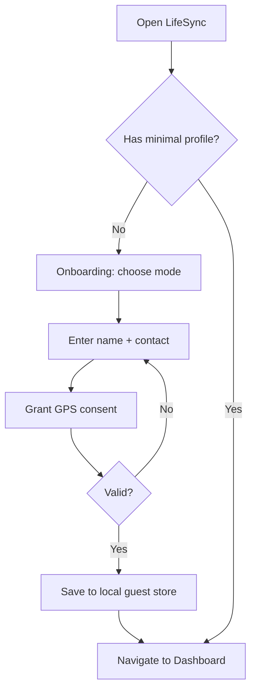

# LifeSync Profile Onboarding UX

## Goals
- Let users start in Guest (offline-first) or plan to Register (Hub) after 7 days
- Collect minimal info (name, contact, GPS consent) required for safety features
- Provide clear notices about local-only vs cloud sync trade-offs
- Support export/import and local restore points

## Flow (Mermaid)

## Screens
- Onboarding: Mode choice (Guest default, Registered locked until day 7)
- Minimal Profile: name, email/phone, location consent (test button)
- Notices: local-only storage, backup options, benefits of registering

## 7-day Gate
- All new users start as Guest; reminders at day 7, 14, 21, 28
- After 7 days, show upgrade prompt; allow continuing as local-only

## Backup/Restore
- Export JSON (encrypted in future phase)
- Create/restore restore points (local snapshots)

